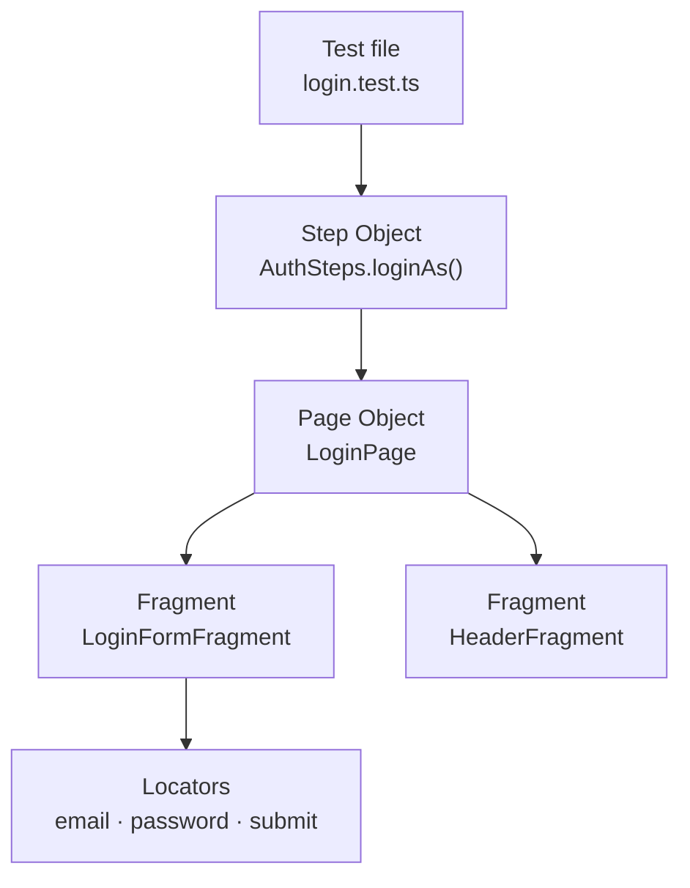
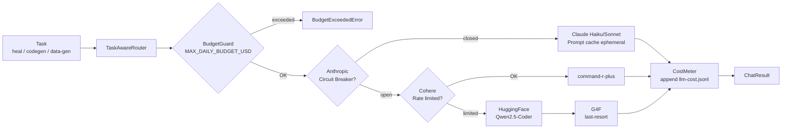
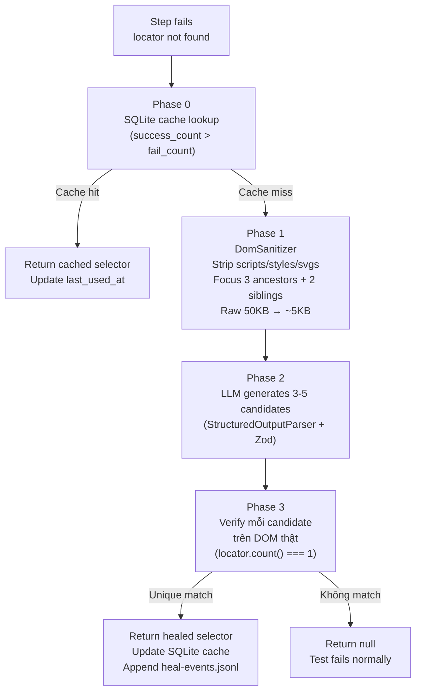
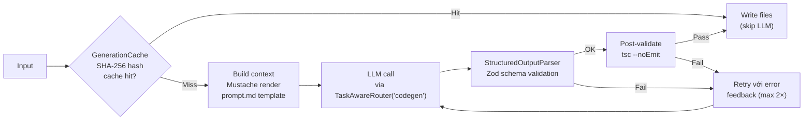

# Architecture: codecept-hybrid Framework

---

## 1. Tổng quan — Hybrid Pattern

Framework dùng 3 lớp abstraction xếp chồng nhau, mỗi lớp có trách nhiệm rõ ràng:

```
Test file        →  "Given I am logged in as admin"  (intent)
Step Object      →  loginAs('admin')                 (business workflow)
Page Object      →  loginPage.open() + loginForm.fillCredentials()
Fragment         →  within('[data-testid="login-form"]', () => I.fillField(...))
```



**Tại sao 3 lớp?**
- **Fragment** — component tái sử dụng. Cùng 1 `HeaderFragment` xuất hiện trên mọi page mà không copy locators.
- **Page** — tổng hợp fragments của 1 màn hình, sở hữu URL path và lifecycle (open, waitForLoad).
- **Step Object** — ngôn ngữ nghiệp vụ. Test đọc như kịch bản (`loginAs`, `logout`, `completeCheckout`) chứ không đọc như automation script (`fillField`, `click`).

---

## 2. Fragment — Anatomy

Mọi Fragment kế thừa `BaseFragment`:

```
BaseFragment
  ├── root: string          ← CSS selector của container
  ├── I: CodeceptJS Actor   ← inject từ CodeceptJS DI
  ├── within(fn)            ← scoped interactions bên trong root
  └── waitToLoad()          ← override nếu cần wait cụ thể
```

Ví dụ `LoginFormFragment`:

```
root = '[data-testid="login-form"]'

Selectors (đọc từ DOM thật):
  email         → input[name="email"]
  password      → input[name="password"]
  submit        → button[type="submit"]
  errorMsg      → .error-message
  rememberMe    → input[name="remember"]
  forgotPassword → [data-testid="forgot-password"]

Methods:
  fillCredentials(email, password)   ← gọi I.fillField trong within(root)
  submit()                           ← click submit trong within(root)
  getError()                         ← grab errorMsg text
  checkRememberMe()                  ← check checkbox
  clickForgotPassword()
```

**Nguyên tắc thiết kế Fragment:**
- Không bao giờ gọi `I.fillField(locator)` với locator viết thẳng trong test — luôn thông qua Fragment method.
- `within(root, fn)` đảm bảo mọi interaction được scoped vào container → tránh chọn nhầm element trùng selector ở trang khác.
- Locators là class property (string) — khi cần sửa chỉ sửa 1 chỗ.

---

## 3. API Layer — RestRequestBuilder

```
RestClient          ← init Playwright APIRequestContext (baseURL + SSL)
    │
RestRequestBuilder  ← Fluent builder
    │   .get(url) / .post(url) / .put / .patch / .delete
    │   .header(k, v) / .headers({...})
    │   .query(k, v) / .params({...})
    │   .json(obj)  →  auto-set Content-Type: application/json
    │   .timeout(ms)
    │   .build()  →  RestRequest
    │
RestHelper          ← CodeceptJS Helper, expose I.api() và I.sendGet/sendPost/...
    │
RestResponse<T>     ← { status, headers, body: T, durationMs }
```

**Dùng trong test:**

```typescript
// Qua RestHelper (inject qua CodeceptJS)
const res = await I.sendGet('/users');

// Qua fluent builder
const res = await I.api().post('/users').json({ name: 'Alice' }).send();
I.assertEqual(res.status, 201);
```

**CurlConverter:** Parse cURL string → RestRequest. Dùng cho `gen api` CLI và debug (copy cURL từ browser DevTools).

---

## 4. AI Layer — LLM Gateway

### 4.1 Provider Chain & Routing



**Provider profiles** (định nghĩa tại `config/ai/providers.profiles.ts`):

| Task | Primary | Model | Temp | MaxTokens |
|---|---|---|---|---|
| `heal` | Anthropic | Haiku 4.5 | 0 | 256 |
| `codegen` | Anthropic | Sonnet 4.6 | 0.2 | 4096 |
| `data-gen` | Cohere | command-r-plus | 0.7 | 1024 |

### 4.2 Circuit Breaker

Mỗi provider có riêng 1 `CircuitBreaker`:
- **Closed** (bình thường) → cho phép call
- **Open** (sau 3 failures liên tiếp) → skip provider ngay lập tức, exponential cooldown
- **Half-open** (sau cooldown) → thử 1 probe call; success → Closed, fail → Open lại

Tránh CI timeout 30s × 100 tests khi Anthropic API down.

### 4.3 Cost Control

```
CostMeter      → append mỗi call vào output/llm-cost.jsonl
BudgetGuard    → check projected spend trước mỗi call
                 throw BudgetExceededError nếu vượt MAX_DAILY_BUDGET_USD (default: $5)
```

Xem chi tiết tại [docs/AI_FEATURES.md](AI_FEATURES.md#cost-control).

---

## 5. Self-Healing — 4 Phase Flow

Khi Playwright không tìm được locator → CodeceptJS `heal` plugin gọi `SelfHealEngine.heal()`:



**DomSanitizer** giảm token cost 70-90%:
- Strip: `<script>`, `<style>`, `<svg>`, `<iframe>`, comments
- Remove: tracking attrs (`data-gtm-*`, `on*`), inline styles, base64
- Truncate: Tailwind class chains dài
- Focus: ancestorLevels=3, siblingsRadius=2 xung quanh failed locator

**LocatorRepository** (SQLite):
- Schema: `test_file`, `original_selector`, `healed_selector`, `success_count`, `fail_count`, `last_used_at`
- Decay: invalidate sau 14 ngày không dùng
- WAL mode: safe cho parallel test runs

---

## 6. Code Generation Pipeline

Tất cả agents (HtmlToFragmentAgent, CurlToApiAgent, ScenarioGeneratorAgent) đi qua `GenerationPipeline` chung:



**HtmlToFragmentAgent** thêm bước pre-processing:
1. `DomSanitizer` — rút gọn HTML
2. `LocatorScorer` — rank top-5 candidates (data-testid → id → text → attr) trước khi feed LLM → LLM chỉ cần đặt tên + tổ chức, không cần "đoán" selector

---

## 7. Hooks Lifecycle

```
┌─ Before suite ──────────────────────────────────────┐
│  globalSetup.ts                                      │
│    → init database, load fixtures, init browser ctx  │
└─────────────────────────────────────────────────────┘

  ┌─ Before scenario ─────────────────────────────────┐
  │  scenarioHooks.ts @BeforeEach                      │
  │    → reset state, setup test data                  │
  └───────────────────────────────────────────────────┘

    Test runs...

  ┌─ After scenario ──────────────────────────────────┐
  │  scenarioHooks.ts @AfterEach                       │
  │    → cleanup test data, log scenario result        │
  │  screenshotOnFail plugin (built-in)                │
  │    → capture PNG → output/screenshots/             │
  └───────────────────────────────────────────────────┘

┌─ After suite ───────────────────────────────────────┐
│  globalTeardown.ts                                   │
│    → close browser context, close DB connections     │
└─────────────────────────────────────────────────────┘
```

**Artifacts per failed scenario** (tự động):
- `output/screenshots/*.png` — screenshotOnFail plugin
- `output/videos/*.webm` — Playwright video (`keepVideoForPassedTests: false`)
- `output/trace/*.zip` — Playwright trace (`keepTraceForPassedTests: false`)

---

## 8. Configuration — Merge Strategy

```
.env.dev / .env.staging / .env.prod
        ↓ (chọn theo ENV=)
EnvResolver.loadEnv()
        ↓
ConfigLoader (Zod schema parse)
        ↓ fail fast nếu thiếu biến bắt buộc
config (frozen singleton)
        ↓ dùng trong
codecept.conf.ts  →  helpers.Playwright.url / browser / headless
                  →  plugins.heal.enabled
                  →  plugins.allure.outputDir
```

**CI override** (`config/codecept.ci.conf.ts`): spread base config + `show: false` + `pauseOnFail: false`. Chạy bằng `-c config/codecept.ci.conf.ts`.

---

## 9. Path Aliases (TypeScript)

| Alias | Giải thích | Ví dụ |
|---|---|---|
| `@core/*` | `src/core/*` | `@core/logger/Logger` |
| `@api/*` | `src/api/*` | `@api/rest/RestRequestBuilder` |
| `@ui/*` | `src/ui/*` | `@ui/fragments/features/LoginFormFragment` |
| `@ai/*` | `src/ai/*` | `@ai/providers/TaskAwareRouter` |
| `@visual/*` | `src/visual/*` | `@visual/VisualComparator` |
| `@fixtures/*` | `src/fixtures/*` | `@fixtures/factories` |
| `@hooks/*` | `src/hooks/*` | `@hooks/globalSetup` |

Runtime resolution: `tsconfig-paths/register` (khai báo trong `require` của `codecept.conf.ts`).
