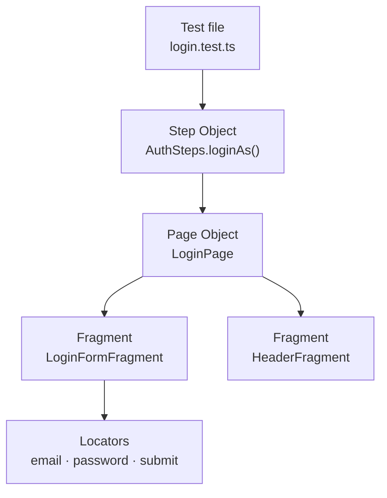
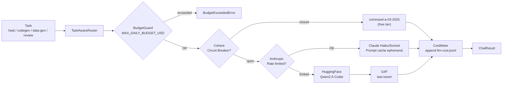
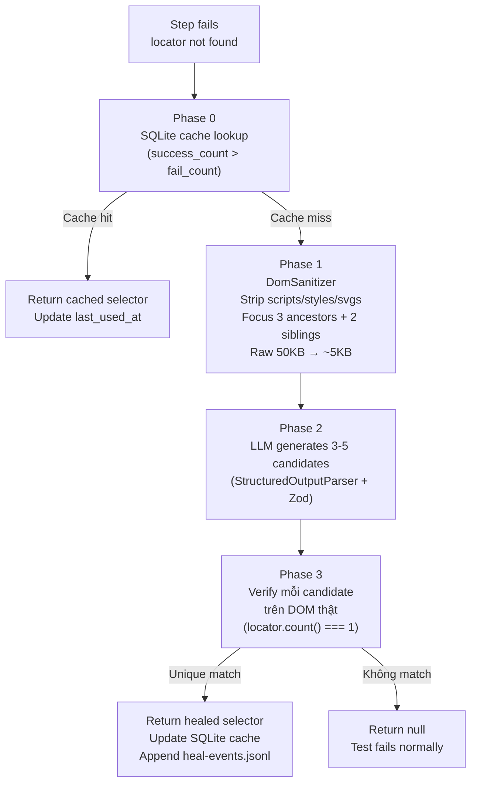
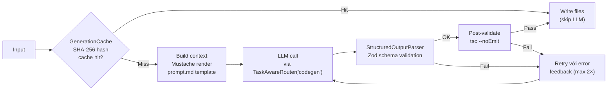

# Architecture: codecept-hybrid Framework

---

## 1. Tổng quan — Hybrid Pattern

Framework dùng 3 lớp abstraction xếp chồng nhau, mỗi lớp có trách nhiệm rõ ràng:

```
Test file        →  "Given I am logged in as admin"  (intent)
Step Object      →  loginAs('admin')                 (business workflow)
Page Object      →  loginPage.open() + loginForm.fillCredentials()
Fragment         →  within('[data-testid="login-form"]', () => I.fillField(...))
```



**Tại sao 3 lớp?**
- **Fragment** — component tái sử dụng. Cùng 1 `HeaderFragment` xuất hiện trên mọi page mà không copy locators.
- **Page** — tổng hợp fragments của 1 màn hình, sở hữu URL path và lifecycle (open, waitForLoad).
- **Step Object** — ngôn ngữ nghiệp vụ. Test đọc như kịch bản (`loginAs`, `logout`, `completeCheckout`) chứ không đọc như automation script (`fillField`, `click`).

---

## 2. Fragment — Anatomy

Mọi Fragment kế thừa `BaseFragment`:

```
BaseFragment
  ├── root: string          ← CSS selector của container
  ├── I: CodeceptJS Actor   ← inject từ CodeceptJS DI
  ├── within(fn)            ← scoped interactions bên trong root
  └── waitToLoad()          ← override nếu cần wait cụ thể
```

Ví dụ `LoginFormFragment`:

```
root = '[data-testid="login-form"]'

readonly selectors = { ... } as const   ← immutable, literal-typed, không thể bị mutate
  email         → 'input[name="email"]'
  password      → 'input[name="password"]'
  submit        → 'button[type="submit"]'
  errorMsg      → '.error-message'
  rememberMe    → 'input[name="remember"]'
  forgotPassword → '[data-testid="forgot-password"]'

Methods:
  fillCredentials(email, password)   ← gọi I.fillField trong await within(root)
  submit()                           ← click submit trong await within(root)
  getError()                         ← grab errorMsg text
  checkRememberMe()                  ← check checkbox trong await within(root)
  clickForgotPassword()
  verifyErrorVisible()               ← assertion method — Step Object gọi cái này
```

**Nguyên tắc thiết kế Fragment:**
- `readonly selectors = { ... } as const` — bắt buộc. Selector là literal string constant, không thể bị reassign.
- Mọi fragment method cần assertion ngoài phải có `async verify*(): Promise<void>` riêng — **Step Object và Test không được truy cập `.selectors` trực tiếp**.
- `await this.within(fn)` đảm bảo mọi interaction được scoped vào container → tránh chọn nhầm element trùng selector ở trang khác. `BaseFragment.within()` trả về `Promise<void>` nên bắt buộc phải `await`.
- `this.I.click()`, `this.I.fillField()`, `this.I.waitForElement()` **không cần `await`** — CodeceptJS type chúng là `void` (queue nội bộ). Chỉ `await` khi gọi `grabTextFrom`, `grabNumberOfVisibleElements` và các method trả về giá trị.
- Locators là class property (string) — khi cần sửa chỉ sửa 1 chỗ.

---

## 3. API Layer — RestRequestBuilder

```
RestClient          ← init Playwright APIRequestContext (baseURL + SSL)
    │
RestRequestBuilder  ← Fluent builder
    │   .get(url) / .post(url) / .put / .patch / .delete
    │   .header(k, v) / .headers({...})
    │   .query(k, v) / .params({...})
    │   .json(obj)  →  auto-set Content-Type: application/json
    │   .timeout(ms)
    │   .build()  →  RestRequest
    │
RestHelper          ← CodeceptJS Helper, expose I.api() và I.sendGet/sendPost/...
    │
RestResponse<T>     ← { status, headers, body: T, durationMs }
```

**Dùng trong test:**

```typescript
// Qua RestHelper (inject qua CodeceptJS)
const res = await I.sendGet('/users');

// Qua fluent builder
const res = await I.api().post('/users').json({ name: 'Alice' }).send();
I.assertEqual(res.status, 201);
```

**CurlConverter:** Parse cURL string → RestRequest. Dùng cho `gen api` CLI và debug (copy cURL từ browser DevTools).

---

## 4. AI Layer — LLM Gateway

### 4.1 Provider Chain & Routing



**Provider profiles** (định nghĩa tại [`config/ai/providers.profiles.ts`](../config/ai/providers.profiles.ts)):

| Task | Primary | Fallback chain | Temp | MaxTokens | cacheSystem |
|---|---|---|---|---|---|
| `heal` | Cohere `command-a-03-2025` | Anthropic Haiku 4.5 → G4F | 0 | 256 | — |
| `codegen` | Cohere `command-a-03-2025` | Anthropic Sonnet 4.6 → Anthropic Haiku 4.5 | 0.2 | 8192 | ✅ (timeout 120s) |
| `data-gen` | Cohere `command-a-03-2025` | Anthropic Haiku 4.5 | 0.7 | 1024 | — |
| `review` | Anthropic Haiku 4.5 | Cohere | 0 | 1024 | ✅ |

**Vì sao Cohere là primary?** 1000 calls/tháng miễn phí trên `command-a-03-2025`, đủ cho hầu hết heal/codegen workflows trong dev/CI. Anthropic được giữ làm fallback chất lượng cao (Sonnet 4.6 có prompt-cache ephemeral giảm 90% chi phí input — chỉ áp dụng khi route fallback sang Anthropic). Nếu team có ngân sách và ưu tiên chất lượng, đảo `primary`/`fallback` trong `providers.profiles.ts` không phá API.

### 4.2 Circuit Breaker

Mỗi provider có riêng 1 `CircuitBreaker`:
- **Closed** (bình thường) → cho phép call
- **Open** (sau 3 failures liên tiếp) → skip provider ngay lập tức, exponential cooldown
- **Half-open** (sau cooldown) → thử 1 probe call; success → Closed, fail → Open lại

Tránh CI timeout 30s × 100 tests khi provider API down (Cohere primary hoặc Anthropic fallback).

### 4.3 Cost Control

```
CostMeter      → append mỗi call vào output/llm-cost.jsonl
BudgetGuard    → check projected spend trước mỗi call
                 throw BudgetExceededError nếu vượt MAX_DAILY_BUDGET_USD (default: $5)
```

Xem chi tiết tại [docs/AI_FEATURES.md](AI_FEATURES.md#cost-control).

---

## 5. Self-Healing — 4 Phase Flow

Khi Playwright không tìm được locator → CodeceptJS `heal` plugin gọi `SelfHealEngine.heal()`:



**DomSanitizer** giảm token cost 70-90%:
- Strip: `<script>`, `<style>`, `<svg>`, `<iframe>`, comments
- Remove: tracking attrs (`data-gtm-*`, `on*`), inline styles, base64
- Truncate: Tailwind class chains dài
- Focus: ancestorLevels=3, siblingsRadius=2 xung quanh failed locator

**LocatorRepository** (SQLite):
- Schema: `test_file`, `original_selector`, `healed_selector`, `success_count`, `fail_count`, `last_used_at`
- Decay: invalidate sau 14 ngày không dùng
- WAL mode: safe cho parallel test runs

---

## 6. Code Generation Pipeline

Tất cả agents (HtmlToFragmentAgent, CurlToApiAgent, ScenarioGeneratorAgent) đi qua `GenerationPipeline` chung:



**Output per agent:**
- `HtmlToFragmentAgent` → `fragments/*.ts` + `pages/*.ts` + `steps/*.ts` + `tests/ui/smoke/*.test.ts`
- `CurlToApiAgent` → `services/*Service.ts` (dùng `config.apiUrl` + relative endpoint) + `tests/api/smoke/*.test.ts`
- `ScenarioGeneratorAgent` → `tests/ui/regression/*.test.ts` (CodeceptJS format) + `src/ui/steps/*Steps.ts` (Step Object)

**HtmlToFragmentAgent** thêm bước pre-processing:
1. `DomSanitizer` — rút gọn HTML
2. `LocatorScorer` — rank top-5 candidates (data-testid → id → text → attr) trước khi feed LLM → LLM chỉ cần đặt tên + tổ chức, không cần "đoán" selector

Xem [config/ai/AGENT_VALIDATION_CHECKLIST.md](../config/ai/AGENT_VALIDATION_CHECKLIST.md) để biết tiêu chuẩn agent phải đạt trước khi ghi file.

---

## 7. Hybrid API Codegen Pipeline (PR-5 → PR-8)

Swagger / cURL input chạy qua pipeline **hybrid**: deterministic rendering + narrow LLM enrichment chỉ ở bước title.

```
Input (Swagger spec | cURL string)
        ↓
EndpointModel[]         ← unified internal type (method, path, params, body schema, auth)
        ↓
TestCasePlanner         ← deterministic test plan (positive + negative cases per endpoint)
  ├── SwaggerNegativeStrategy  (missing-required, type-mismatch, boundary per JSON Schema)
  └── CurlNegativeStrategy     (status variants từ --expected-status flag)
        ↓
DataFactory             ← json-schema-faker (seed-deterministic) → payload objects
        ↓
ScenarioEnricher        ← LLM title-only call (<12 words) hoặc auto-title (--no-llm)
        ↓
ServiceTemplate         ← deterministic render → *Service.ts
TestTemplate            ← deterministic render → *.test.ts
        ↓
ApiPostValidator        ← regex rules + tsc --noEmit
  ├── checkServiceRules: no ambient headers, no Content-Type via .header()
  └── checkTestRules:    expectSchema identifier, @negative-auth-* uses init() overrides
        ↓
Write files to disk
```

### Tại sao hybrid thay vì LLM toàn phần?

| | LLM thuần (cũ) | Hybrid (mới) |
|---|---|---|
| Cấu trúc file | LLM tự phát minh | Deterministic 100% |
| Tên trường/method | Sáng tạo tự do → sai checklist | Template cố định |
| Payload data | LLM "bịa" | json-schema-faker + seed |
| Tiêu đề scenario | LLM (hợp lý) | LLM title-only / auto |
| Token cost per endpoint | ~8 000 tok | ~300 tok (title only) |
| ApiPostValidator pass rate | ~60% | ~98% |

### EndpointModel

Unified internal type — cả SwaggerToApiAgent lẫn CurlToApiAgent đều output `EndpointModel[]` trước khi đến TestCasePlanner:

```typescript
interface EndpointModel {
  method: 'GET' | 'POST' | 'PUT' | 'PATCH' | 'DELETE';
  path: string;                    // relative: '/api/GiftList/Find'
  operationId: string;             // PascalCase → class/method names
  summary?: string;
  requestBodySchema?: JSONSchema;  // Swagger requestBody hoặc infer từ cURL body
  responseSchema?: JSONSchema;     // Swagger 200/201 response
  pathParams: ParamModel[];
  queryParams: ParamModel[];
  auth?: { required: boolean; headerName?: string };
  tags: string[];
}
```

### DataFactory

`DataFactory` dùng `json-schema-faker` với seed cố định để tạo payloads **lặp lại được**:

- **Positive**: `DataFactory.generate(schema, { seed: 42 })` → valid object
- **Negative mutation strategies**: `missing-required` | `wrong-type` | `boundary-min` | `boundary-max` | `null-value`

```typescript
const badPayload = DataFactory.mutate(payload, { strategy: 'missing-required', field: 'name' });
```

### ScenarioEnricher

LLM call chỉ sinh **title** cho mỗi test case (< 12 words, tiếng Anh). Toàn bộ cấu trúc, assertion, lifecycle không liên quan đến LLM:

```
Input:  { method: 'POST', path: '/api/GiftList/Find', testType: 'missing-required', field: 'name' }
Output: "Find gift list with missing name returns 400"
```

`--no-llm` flag → auto-title từ template `"POST /api/GiftList/Find — missing name → 400"`. Không tốn token.

### ApiPostValidator — PR-8 additions

Validator chạy sau render, trước khi ghi file:

| Rule | Mô tả |
|---|---|
| No ambient `.header()` | Service không emit `.header('Token'…)` / `.header('Authorization'…)` / `.header('Lng'…)` / `.header('Tz'…)` — `RestClient.init()` inject tự động |
| No Content-Type | `.header('Content-Type'…)` bị cấm — `.json()` set tự động |
| `expectSchema` identifier | `expectSchema(INLINE_OBJECT)` bị cấm — phải dùng `expectSchema(IDENTIFIER)` |
| Cross-file identifier | Identifier trong test phải export từ service file |
| `@negative-auth-*` init | Phải dùng `client.init({ skipAmbient: … })` — không phải bare `.header()` |
| No raw `${…}` in svc args | Template literals trong svc call args phải đi qua `dataCtx.resolve()` |

---

## 8. Hooks Lifecycle

```
┌─ Before suite ──────────────────────────────────────┐
│  globalSetup.ts                                      │
│    → init database, load fixtures, init browser ctx  │
└─────────────────────────────────────────────────────┘

  ┌─ Before scenario ─────────────────────────────────┐
  │  scenarioHooks.ts @BeforeEach                      │
  │    → reset state, setup test data                  │
  └───────────────────────────────────────────────────┘

    Test runs...

  ┌─ After scenario ──────────────────────────────────┐
  │  scenarioHooks.ts @AfterEach                       │
  │    → cleanup test data, log scenario result        │
  │  screenshotOnFail plugin (built-in)                │
  │    → capture PNG → output/screenshots/             │
  └───────────────────────────────────────────────────┘

┌─ After suite ───────────────────────────────────────┐
│  globalTeardown.ts                                   │
│    → close browser context, close DB connections     │
└─────────────────────────────────────────────────────┘
```

**Artifacts per failed scenario** (tự động):
- `output/screenshots/*.png` — screenshotOnFail plugin
- `output/videos/*.webm` — Playwright video (`keepVideoForPassedTests: false`)
- `output/trace/*.zip` — Playwright trace (`keepTraceForPassedTests: false`)

---

## 9. Configuration — Merge Strategy

```
.env.dev / .env.staging / .env.prod
        ↓ (chọn theo ENV=)
EnvResolver.loadEnv()
        ↓
ConfigLoader (Zod schema parse)
        ↓ fail fast nếu thiếu biến bắt buộc
config (frozen singleton)
        ↓ dùng trong
codecept.conf.ts  →  helpers.Playwright.url / browser / headless
                  →  plugins.heal.enabled
                  →  plugins.allure.outputDir
```

**CI override** (`config/codecept.ci.conf.ts`): spread base config + `show: false` + `pauseOnFail: false`. Chạy bằng `-c config/codecept.ci.conf.ts`.

---

## 10. Path Aliases (TypeScript)

| Alias | Giải thích | Ví dụ |
|---|---|---|
| `@core/*` | `src/core/*` | `@core/logger/Logger` |
| `@api/*` | `src/api/*` | `@api/rest/RestRequestBuilder` |
| `@ui/*` | `src/ui/*` | `@ui/fragments/features/LoginFormFragment` |
| `@ai/*` | `src/ai/*` | `@ai/providers/TaskAwareRouter` |
| `@visual/*` | `src/visual/*` | `@visual/VisualComparator` |
| `@fixtures/*` | `src/fixtures/*` | `@fixtures/factories` |
| `@hooks/*` | `src/hooks/*` | `@hooks/globalSetup` |

Runtime resolution: `tsconfig-paths/register` (khai báo trong `require` của `codecept.conf.ts`).
